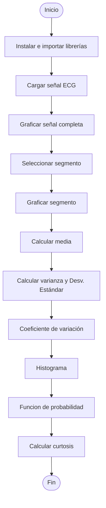

# Laboratorio 1 estadistica
En este laboratorio exploramos señales fisiológicas de ECG utilizando técnicas de estadística descriptiva y modelos de ruido. El objetivo es entender tanto las características propias de la señal como el impacto del ruido, analizando aspectos como la relación señal-ruido (SNR) 

---
<h1 align="center"><i><b>PARTE A DEL LABORATORIO</b></i></h1>




+ **importación de librerias y carga de señal**
```python
!pip install wfdb
import matplotlib.pyplot as plt
import numpy as np
import wfdb
import pandas as pd
import os
from scipy.stats import norm
import seaborn as sns
```
Se instalan la libreria `wfdb` para leer archivos locales (.hea, .dat, etc.) del directorio de trabajo. 
Se importan diferentes librerias necesarias para desarrollar el código con sus funciones.

```python
record_name= '100001_ECG'
señal,caracter = wfdb.rdsamp(record_name)
```
Carga la señal, `record_name` debe ser el nombre del archivo (ej: `100001_ECG`).
Nombra la señal `señal`.

---
+ **visualización señal**
```python
plt.figure(figsize=(12, 4))
plt.plot(señal,color="deeppink")
plt.title("Visualización de la Señal Médica")
plt.xlabel("Muestras")
plt.ylabel("Voltaje(μm)")
plt.grid(True)
plt.show()

```
**Resultado:**

<p align="center">

</p>


Grafica la señal completa, nombra los ejes (Ej:`muestras v.s voltaje`).


---

+ **Selección de un segmento de la señal**
```python
signal=señal[2000000:2010000]
plt.plot(signal,color="deeppink")
plt.title("Visualización de la Señal Médica")
plt.xlabel("Muestras")
plt.ylabel("Voltaje(μm)")
plt.grid(True)
plt.show()
```

Recortar la señal entre las muestras `2,000,000` y `2,010,000` (10,000 muestras). Se recomienda no tomar los valores iniciales ya que pueden ser muy variables mientras la extracción de la señal se estabiliza.
Se grafica esta nueva señal llamada `signal`.

**Resultado:**

<p align="center">


</p>

---

+ **Promedio o media**
```python
suma = 0
n = 0
for muestra in signal:
  suma=suma+muestra
  n=n+1
  promedio=suma/n

print("promedio=", promedio)
```
Se calcula de forma manual la media usando un bucle `for` y finalmente se imprime este valor.

**Resultado:** promedio= [51.83181363]


---


+ **Varianza y desviación estándar**
```python
sumaCuadrados = 0
for muestra in signal:
    diferencia = muestra - promedio
    sumaCuadrados += diferencia ** 2

varianza = sumaCuadrados / n
desviacionEstandar = varianza ** 0.5

print("Desviación Estándar:", desviacionEstandar)
print("varianza:", varianza)
```
Calcula la `varianza`, que es la dispersión de los datos con respecto a la media, y posteriormente calcula la `Desviación estándar` que es la raiz cuadrada de la varianza. 

**Resultados:**

*Desviación Estándar: [312.3767537]

*varianza: [97579.23625063]

---

+ **Coeficiente de variación**
```python
Coeficiente=(desviacionEstandar/promedio)*100
print("Coeficiente de Variacion:", Coeficiente)
```
Mide la variabilidad relativa de los datos con respecto a su media en valor porcentual.

**Resultado:**

Coeficiente de Variacion: [602.6737863]

---

+ **Histograma y función de probabilidad**
```python
plt.figure()
plt.hist(signal,bins=100,density=0,color='deeppink')
plt.title("Histograma")
plt.xlabel("Voltaje(μv)")
plt.ylabel("Frecuencia ")
plt.show()
```
Grafica un histograma y nombra los ejes *x* y *y*.

**Resultado:**

<p align="center">

</p>

```python
plt.figure(figsize=(10, 5))
sns.histplot(signal, bins=100, stat="count", kde=True)
plt.title('Histograma con función KDE')
plt.xlabel('Voltaje (μV)')
plt.ylabel('Frecuencia')
plt.grid(True)
plt.show()
```
grafica el histograma nuevamente, pero con la curva de la `función de probabilidad`.

**Resultado:**

<p align="center">

</p>

`sns.histplot`:Es una funcion de seaborn para realizar histogramas y de forma estilizada.

`signal`: se guardan los datos obtenidos de la señal descargada.

 `bins=100`: divide los datos en 100 barras (más detalle en el histograma).
 
`stat="count"`: el eje Y muestra la cantidad de veces que aparece cada valor (frecuencia).

`kde=True`: agrega la curva de funcion de probabilidad encima del histograma realizado.

---
+ **Curtosis**
```python
numerador = sum((x - promedio)**4 for x in signal) / n
denominador = (sum((x - promedio)**2 for x in signal) / n) ** 2
curtosis= numerador / denominador

print("Curtosis:", curtosis)
```
Calcula la curtosis, la cual describe que tan achatados o afilados son los picos de la señal en comparación con una distribución normal (campana de gauss).

**Resultado:**

*Curtosis: [15.20632096]

---

<h1 align="center"><i><b>PARTE B DEL LABORATORIO</b></i></h1>

+ **visualizacion de la señal extraida del generador biologico**
  
Inicialmente se extrajo la señal desde un generador de señales, usando un DAQ. Para esto se descargó el programa NI DAQ MX y se configuro como finite samples para extraer 100 muestras. Después en mathlab con Data acquisition toolbox se definió la frecuencia de muestreo. Estos datos organizados en una tabla se exportaron como archivo `.csv `para finalmente abrir la tabla en Excel.

posteriormente se lee el registro usando una función de pandas llamada `pd.read_csv()`, y se nombran las columnas x y y, para despues guardarlo en la variable `signal2`.

```python
df = pd.read_csv('medicion1.csv')
x = df.iloc[:, 0]
y = df.iloc[:, 1]
plt.figure(figsize=(10, 5))
plt.plot(x,y,color='springgreen')
plt.title('Señal extraida del generador')
plt.xlabel('Tiempo (s)')
plt.ylabel('Voltaje (mV)')
plt.grid(True)
plt.show()
signal2= df.iloc[:, 1]
```

<p align="center">

</p>

  Se vuelven a calcular manualmente los estadisticos descriptivos de la señal como se hizo en la parte A.
  
+ **promedio o media**
  
```pyton
suma=0
n = 0
for muestra in signal2:
  suma=suma+muestra
  n=n+1

  promedio2=suma/n
print("promedio=", promedio2)
```
**Resultado:**

promedio= 1.2196760663788881

+ **desviacion estandar y varianza**
```pyton
suma = 0
n = 0
for muestra in signal2:
    suma += muestra
    n += 1
sumaCuadrados2 = 0
for muestra in signal2:
    diferencia = muestra - promedio
    sumaCuadrados2 += diferencia ** 2

varianza2 = sumaCuadrados2 / n
desviacionEstandar2 = varianza2 ** 0.5

print("Desviación Estándar:", desviacionEstandar2)
print("varianza:", varianza2)
```
**Resultados**

Desviación Estándar: [50.61372746]
varianza: [2561.74940787]

+ **coeficiente de variacion**
```pyton
  Coeficiente2=(desviacionEstandar2/promedio2)*100
print("Coeficiente de Variación:", Coeficiente2)
```
**Resultado:**

Coeficiente de Variación: [4149.76802939]

+ **histograma y funcion de probabilidad**


<h1 align="center"><i><b>PARTE C DEL LABORATORIO</b></i></h1>
A la señal de la parte B (signal2) se le contamina con 3 tipos de ruido diferentes para despues calcular su valor SNR.

---
+ **Ruido gaussiano**


---

+ **Ruido impulso**

---

+**Ruido artefacto**

